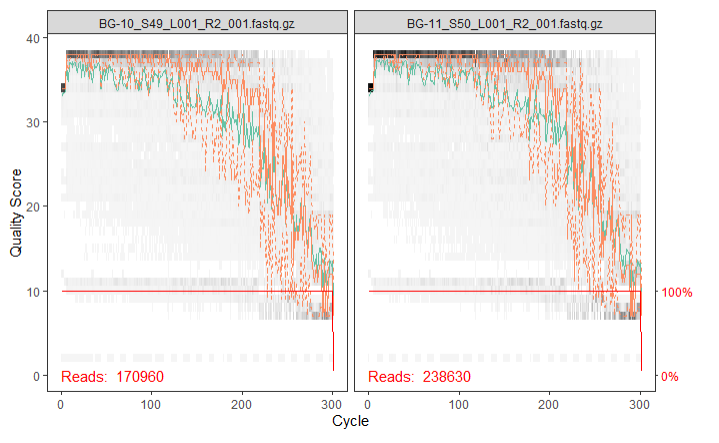

# 16S tutorial - METABARCODING (Using R)
>[!WARNING]
>This tutorial will work with R code. Usage of R Studio is recommended for a better understading of the commands used

## Table of Contents

- [Download the tutorial data](#Download-the-tutorial-data)
- [Installing Packages](#Installing-Packages)
- [Quality Control](#Quality-Control)
- [DADA2](#DADA2)
- [Assign Taxonomy](#Assign-Taxonomy)
- [Phylogenetic Tree](#Phylogenetic-tree)
- [Phyloseq](#Phyloseq)
## Download the tutorial data

:heavy_exclamation_mark: The next data can be downloaded manually if you are not using shell by searching the links shown in the next commands

```Bash
wget http://www.mothur.org/w/images/d/d6/MiSeqSOPData.zip
wget https://zenodo.org/record/3731176/files/silva_nr_v138_train_set.fa.gz?download=1
wget https://zenodo.org/record/3731176/files/silva_species_assignment_v138.fa.gz?download=1

#unzip the compressed document MISEQSOPData.zip and remove the __MACOSX/ directory
#it is also recommended to move the SILVA files into the MiSeq_S0P directory
unzip MiSeqSOPData.zip
rm -r __MACOSX/
```
## Installing Packages
For installing all the packages needed for the 16S analysis first we need to install Bioconductor :inbox_tray:


```R
if (!require("BiocManager", quietly = TRUE))
    install.packages("BiocManager")
BiocManager::install(version = "3.17")
```

Then install the next packages 
```R
BiocManager::install('dada2')
BiocManager::install('phyloseq')
BiocManager::install('DECIPHER')
install.packages('ggplot2')
install.packages('phangorn')
```

## Quality Control

Quality Control of the samples can be performed using R or using the Shell scripts explained in the [Quality Control turorial](https://github.com/Ecological-and-Evolutionary-Omics/Quality-and-Trimming)

```R
#if you are using Windows remember to change the "\" in the path for "/"
path <- 'MiSeq_SOP'
list.files(path)
```
We are going to automatize a huge part of the process by making a list of all the files containing _R1_001.fastq or _R2_001.fastq
```R
raw_forward <- sort(list.files(path, pattern="_R1_001.fastq.gz",
                               full.names=TRUE))

raw_reverse <- sort(list.files(path, pattern="_R2_001.fastq.gz",
                               full.names=TRUE))

# we also need the sample names
sample_names <- sapply(strsplit(basename(raw_forward), "_"),
                       `[`,  # extracts the first element of a subset
                       1)
# Another option will be
sample_names <- gsub("_R1_001.fastq.gz", "", raw_forward)
```
### Check Quality of the reads

```R
plotQualityProfile(raw_forward[1:2]) 
plotQualityProfile(raw_reverse[1:2])

#you can change the number of samples shown by changing the [1:2] parameter
#to any type of selection 
```
Now an image like this should be visible in your screen (:warning: This is just an example picture don't panic :scream:, your image should look different :thumbsup:)



### Trimming

Before Trimming we should also create a filtered directory to save our trimmed samples.

We are also creating a list of names with the end "trimmed", this list will be helpfull when
automating the process for different samples

```R
# place filtered files in filtered/ subdirectory
filtered_path <- file.path(path, "filtered")

filtered_forward <- file.path(paste0(sample_names, "_R1_trimmed.fastq.gz"))

filtered_reverse <- file.path(paste0(sample_names, "_R2_trimmed.fastq.gz"))
```

Once we have taken a look to our reads, we can determine which will be the ranges to trim. Take into account that we have to take into account both at the R1 and R2 graphics to make the decision,
as the trimming should be equal for both reads. Once we have selected the regions to trim, we can execute the next code:

> [!IMPORTANT]
>In ```truncLen```we should mark the last and the first nucleotide after the trimming , **in that order**.

```R
out <- filterAndTrim(raw_forward, filtered_forward, raw_reverse,
                     filtered_reverse, truncLen=c(240,160), maxN=0,
                     maxEE=c(2,2), truncQ=2, rm.phix=TRUE, compress=TRUE,
                     multithread=TRUE)
head(out)
```


## DADA2

DADA2 is the main package that we will be using for the 16S analysis, it is based on al algorithm that depends on a parametric error model
and every amplicon dataset has a slightly different error rate. Therefore, we need to learn the errors for our forward and reverse reads.

```R
errors_forward <- learnErrors(filtered_forward, multithread=TRUE)
errors_reverse <- learnErrors(filtered_reverse, multithread=TRUE)

#you can visualize the estimated error rates with this command
plotErrors(errors_forward, nominalQ=TRUE) +
    theme_minimal()
```
> [!NOTE]
>If you are using a **Windows computer**, this process might take a longer, as the ```multithread``` option is disabled for this system

### Dereplication

To reduce the time of computation ```DADA2``` uses **dereplication**. This eliminates redundant comparisons by combining all identical reads into a "unique sequences" with a corresponding "abundance" for each of them.

```R
derep_forward <- derepFastq(filtered_forward, verbose=TRUE)
derep_reverse <- derepFastq(filtered_reverse, verbose=TRUE)
# name the derep-class objects by the sample names
names(derep_forward) <- sample_names
names(derep_reverse) <- sample_names
```

### Sample Inference

```DADA2``` now samples some of the real sequence variants from the total of unique sequences (dereplicated data), to extract the inference needed for the algorithm

>If you are not familiarized with the term _inference_ just think about it like assuming a general tendence or other type of information based on a sample

```R
dada_forward <- dada(derep_forward, err=errors_forward, multithread=TRUE)
dada_reverse <- dada(derep_reverse, err=errors_reverse, multithread=TRUE)

# inspect the dada-class object
dada_forward[[1]]
```

### Merge Paired-end Reads

The process of merging paired reads is sometimes called overlapping or assembly of read pairs. The goal of merging is to convert a pair into a single read containing one 
sequence and one set of quality scores. A pair must overlap over a significant fraction of its length.

> [!NOTE]
> If you need more information, or you need to visualize how paired-end reads are formed. we highly recommend you this video :
>[Illumina Paired-End Sequencing](https://www.youtube.com/watch?v=-8fG9ruvbe4&ab_channel=ZhiJ.Lu)

```R
merged_reads <- mergePairs(dada_forward, derep_forward, dada_reverse,
                           derep_reverse, verbose=TRUE)

# inspect the merger data.frame from the first sample
head(merged_reads[[1]])
```
### Construct Sequence Table

The sequence table is a higher-resolution version of the OTU table produced by traditional methods.

```R
seq_table <- makeSequenceTable(merged_reads)
dim(seq_table)

# inspect distribution of sequence lengths
table(nchar(getSequences(seq_table)))
```

### Remove Chimeras

>[!NOTE]
>Chimeras are artifact sequences formed by two or more biological sequences incorrectly joined together. This often occurs during PCR reactions using mixed templates 
>(i.e., uncultured environmental samples)

During this process we have already remove substitutions and indel errors but chimeras reamin and we need to remove them. Use the next commands to make it.

```R
seq_table_nochim <- removeBimeraDenovo(seq_table, method='consensus',
                                       multithread=TRUE, verbose=TRUE)
dim(seq_table_nochim)

# which percentage of our reads did we keep?
sum(seq_table_nochim) / sum(seq_table)
```

check how many reads made it through each step during this pipeline

```R
get_n <- function(x) sum(getUniques(x))

track <- cbind(out, sapply(dada_forward, get_n), sapply(merged_reads, get_n),
               rowSums(seq_table), rowSums(seq_table_nochim))

colnames(track) <- c('input', 'filtered', 'denoised', 'merged', 'tabled',
                     'nonchim')
rownames(track) <- sample_names
head(track)
```
## Assign Taxonomy

The SILVA database is a 16S and 18S rRNA database used for the identification and classification of microorganisms

```R
taxa <- assignTaxonomy(seq_table_nochim,
                       'silva_nr_v138_train_set.fa.gz',
                       multithread=TRUE)
taxa <- addSpecies(taxa, 'silva_species_assignment_v138.fa.gz')
```

If you want to inspect the classification, you can use this set of commands:

```R
taxa_print <- taxa  # removing sequence rownames for display only
rownames(taxa_print) <- NULL
head(taxa_print)
```

## Phylogenetic Tree

DADA2 is a reference-free program so we have to build the phylogenetic Tree by ourselves,
We will be using a maximum-likelihood tree build with a neighbour-joining tree as a starting point.
But first, let's align our sequences.

```R
sequences <- getSequences(seq_table)
names(sequences) <- sequences  # this propagates to the tip labels of the tree
alignment <- AlignSeqs(DNAStringSet(sequences), anchor=NA)
```

```R
phang_align <- phyDat(as(alignment, 'matrix'), type='DNA')
dm <- dist.ml(phang_align)
treeNJ <- NJ(dm)  # note, tip order != sequence order
fit = pml(treeNJ, data=phang_align)

## Phyloseq

To use the Phyloseq first we need to load the metadata. The metadatafile is a file were a summary of the information regarding the samples is
displayed. For this tutorial you have at your disposal the metadata.txt [here](https://hadrieng.github.io/tutorials/data/16S_metadata.txt)
This metadatafile is only usable for this tutorial, remember that for every set of samples there is a metadata file linked to them, so **they are unique
and untransferable**. Now, let's construct the phyloseq object from our output and newly created metadata.

```R
sample_data <- read.table('16S_metadata.txt',header=TRUE, row.names="sample_name")

physeq <- phyloseq(otu_table(seq_table_nochim, taxa_are_rows=FALSE),
                   sample_data(sample_data),
                   tax_table(taxa),
                   phy_tree(fitGTR$tree))
# remove mock sample
physeq <- prune_samples(sample_names(physeq) != 'Mock', physeq)
physeq
```
### Alpha diversity

>Alpha diversity refers to diversity on a local scale, describing the species diversity (richness) within a functional community. 
```R
plot_richness(physeq, x='day', measures=c('Shannon', 'Fisher'), color='when') +
    theme_minimal()
```

### Beta diversity

>Beta diversity is defined as the extent of change in community composition, or degree of community differentiation, in relation 
>to a complex-gradient of environment, or a pattern of environments.

We can perform an MDS (multidimensional scaling) with euclidean distance or with Bray-Curtis distance. This transformations allow
us to see in a clearer way the differences between our samples.

```R
#for Euclidean
ord <- ordinate(physeq, 'MDS', 'euclidean')
plot_ordination(physeq, ord, type='samples', color='when',
                title='PCA of the samples from the MiSeq SOP') +
    theme_minimal()

#for Bray-Curtis
ord <- ordinate(physeq, 'NMDS', 'bray')
plot_ordination(physeq, ord, type='samples', color='when',
                title='PCA of the samples from the MiSeq SOP') +
    theme_minimal()
```

### Distribution of the most abundant families

We can make a barplot that displays the distribution of the families analyzed
```R
top20 <- names(sort(taxa_sums(physeq), decreasing=TRUE))[1:20]
physeq_top20 <- transform_sample_counts(physeq, function(OTU) OTU/sum(OTU))
physeq_top20 <- prune_taxa(top20, physeq_top20)
plot_bar(physeq_top20, x='day', fill='Family') +
    facet_wrap(~when, scales='free_x') +
    theme_minimal()
```

We can also place them in Tree

```R
bacteroidetes <- subset_taxa(physeq, Phylum %in% c('Bacteroidetes'))
plot_tree(bacteroidetes, ladderize='left', size='abundance',
          color='when', label.tips='Family')
```
## negative edges length changed to 0!

fitGTR <- update(fit, k=4, inv=0.2)
fitGTR <- optim.pml(fitGTR, model='GTR', optInv=TRUE, optGamma=TRUE,
                    rearrangement = 'stochastic',
                    control = pml.control(trace = 0))
detach('package:phangorn', unload=TRUE)
```
